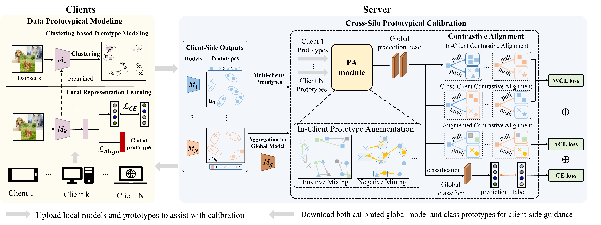

# FedCSPC
(ACM MM'23) Cross-Silo Prototypical Calibration for Federated Learning with Non-IID Data

## Overview
This paper presents a novel Cross-Silo Prototypical Calibration method, termed FedCSPC. As illustrated in Figure \ref{fig:mg}, compared with conventional federated learning method, the proposed FedCSPC performs prototypical calibration, which can map representations from different feature spaces to a unified space while maintaining clear decision boundaries. Specifically, FedCSPC has two main modules: the Data Prototypical Modeling (DPM) module and the Cross-Silo Prototypical Calibration (CSPC) module. To promote the alignment of features across different spaces, the DPM module employs clustering to model the data patterns and provides prototypical information to the server to assist with model calibration. Subsequently, to enhance the robustness of calibration, FedCSPC develops an augmented contrastive learning method in the CSPC module, which increases sample diversity by positive mixing and  hard negative mining, and implements contrastive learning to achieve effective alignment of cross-source features. Meanwhile, the calibrated prototypes form a knowledge base in a unified space and generate knowledge-based class predictions to reduce errors. Notably, the CSPC module is a highly adaptable tool that easily integrates into various algorithms. As observed, FedCSPC is capable of alleviating the feature gap between data sources, thus significantly improving the generalization ability. 



## Dependencies
* PyTorch >= 1.0.0
* torchvision >= 0.2.1
* scikit-learn >= 0.23.1


## Parameters

| Parameter                      | Description                                 |
| ----------------------------- | ---------------------------------------- |
| `model`                     | The model architecture. Options: `simple-cnn`, `resnet18` .|
| `alg` | The training algorithm. Options: `CSPC` |
| `dataset`      | Dataset to use. Options: `cifar10`. `cifar100`, `tinyimagenet`|
| `lr` | Learning rate. |
| `batch-size` | Batch size. |
| `epochs` | Number of local epochs. |
| `n_parties` | Number of parties. |
| `sample_fraction` | the fraction of parties to be sampled in each round. |
| `comm_round`    | Number of communication rounds. |
| `partition` | The partition approach. Options: `noniid`, `iid`. |
| `beta` | The concentration parameter of the Dirichlet distribution for non-IID partition. |
| `out_dim` | The output dimension of the projection head. |
| `datadir` | The path of the dataset. |
| `logdir` | The path to store the logs. |
| `device` | Specify the device to run the program. |
| `seed` | The initial seed. |


## Usage

Here is an example to run FedCSPC on CIFAR-10 with a simple CNN:
```
python main_CSPC.py --dataset=cifar10     --model=simple-cnn     --alg=CSPC     --lr=0.01        --epochs=10     --comm_round=100     --n_parties=10     --partition=noniid 
    --beta=0.5     --logdir='./logs/'     --datadir='./data/' 
```

## Citation
Please cite our paper if you find this code useful for your research.
```
@article{qi2023cross,
  title={Cross-Silo Prototypical Calibration for Federated Learning with Non-IID Data},
  author={Qi, Zhuang and Meng, Lei and Chen, Zitan and Hu, Han and Lin, Hui and Meng, Xiangxu},
  journal={arXiv preprint arXiv:2308.03457},
  year={2023}
}


